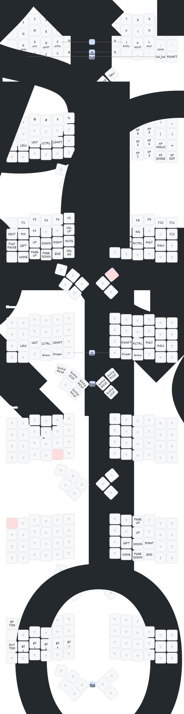

# ZMK Charybdis Firmware

## Introduction
This repository contains firmware for the **ZMK Charybdis 4x6** keyboard, built for the **nice_nano_v2** controller.  
It supports two configurations:  
- Keyboard without dongle (Bluetooth + USB)  
- Keyboard with dongle (Bluetooth + USB)

## Usage
Prebuilt firmware files are available in the [Actions Workflows](https://github.com/dakhar/zmk-keyboard-charybdis/actions?query=is%3Acompleted+is%3Asuccess+branch%3Amain+).  

To download them:  
1. Log in to GitHub.  
2. Open the link above.  
3. Select the latest successful workflow run on the **main** branch.  
4. Download the `firmware.zip` archive that contains all the builds.

### Firmware for Charybdis keyboard **with Bluetooth/USB dongle**
- **charybdis4x6_dongle.uf2** – base dongle firmware  
- **charybdis4x6_dongle_studio.uf2** – dongle firmware with ZMK Studio enabled  
- **charybdis4x6_right_periph.uf2** – right half firmware  
- **charybdis4x6_left.uf2** – left half firmware  

### Firmware for Bluetooth/USB Charybdis keyboard **without dongle**
- **charybdis4x6_right.uf2** – base right half firmware  
- **charybdis4x6_right_studio.uf2** – right half firmware with ZMK Studio enabled  
- **charybdis4x6_left.uf2** – left half firmware  

### Utility firmware
- **reset_nice_nano_v2.uf2** – fully resets the controller firmware  

## Notes
- In ZMK terminology, the **central** half of a split keyboard is the one that sends keystrokes over USB or advertises itself via Bluetooth. The **peripheral** half only sends key events to the central half once paired.  
  For Bluetooth/USB configurations, the **right side** serves as the central half.  

- The Bluetooth/USB firmware supports wireless connectivity, but the central side’s battery life will be shorter because it maintains the Bluetooth connection.  

- The central half can also be connected via USB, allowing the keyboard to function even when Bluetooth is unavailable (e.g., in BIOS).  

- The dongle-based configuration provides much better battery life for the right half but requires an additional MCU. It connects only through the dongle, which can communicate via USB or Bluetooth if it has an external power source.  

## Keymaps & Layers

